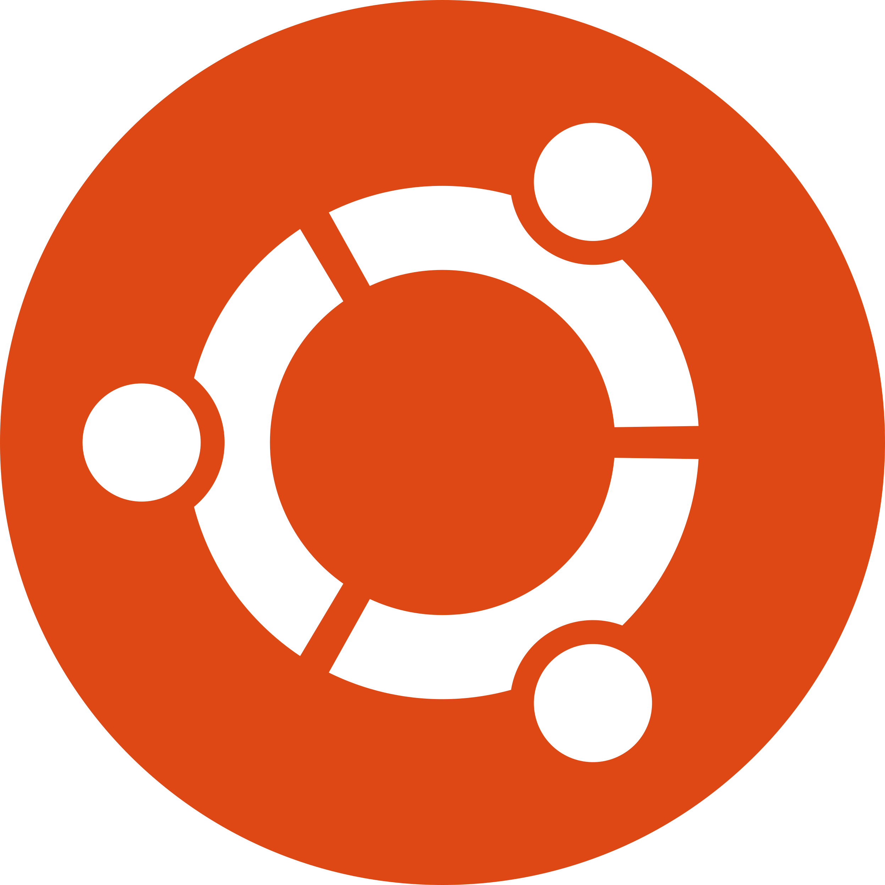
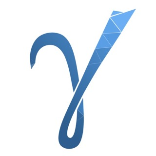
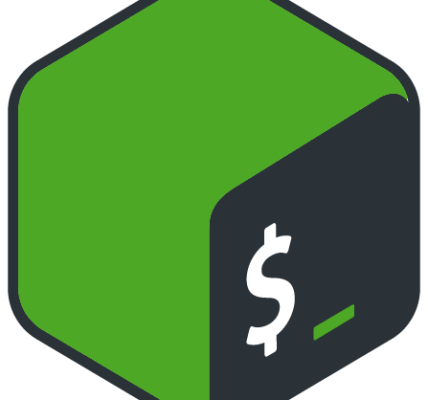

### Hi there I'm Sam, nice to see you here

 
A young, cheerful and enthusiastic engineer from Russia 😄. I am a first year engineering student at the University of Cassino in Italy on a master's degree program.
I am a big fan of C/C++, Qt, JS, Linux and many other programming related things. As a bachelor's student, at <a href="https://www.stc-spb.ru/">work</a> i participated in the creation of various kinds of monitoring complexes for the gsm/umts/lte mobile network and 802.11 standard networks. During my work in this company, I was engaged in the development of software and hardware.The main projects were the creation of a complex for monitoring mobile networks of various standards and a complex for 
monitoring 802.11 networks. 

##### My main tasks were:

* Design GUI using qt-api qt/qml mvc etc
* Development data processing logic in the application and linking with gui
* Development with third-party libraries : GUI, web-channel, maps, embedded
* Development of the business logic of the stm32 microcontroller, deployment of the operating system on it (freeRtos)
* Design protocols for interaction and encryption over a communication channel for compatibility of different versions of transceivers
* Development Drivers for the Interaction of the Board Developed by LLC STC and Third Party Equipment (Special Control Keyboard)
* Development application plugins to interact with the database (PostgreSQL)
* Development third-party libraries to use different modules for different types of data transfer (over the cabel, through the server, 802.11)

### My strengths include: 
* Perseverance
* The ability to google and to find 
* Good and high-quality understanding of issues
* The Famociest one - great love for programming!
 
 

## My Stats 😄 
##### Adding code here started in 2022

## Top Git Languages 😄

## Software stack

|  N| pic | Name|  
| ------ |------|------|
| 1. |  | Ubuntu 20.05 | 
| 2. |  | C++11/14/17 | 
| 3. |  | Qt 5.15, Qt Quick & Qt Creator & Qt Designer| 
| 4. |  | Git |
| 5. |  | PostgreSQL 11+ | 
| 6. |  | GammaRay | 
| 7. |  | VS-Code | 
| 8. |  | Javascript | 
| 9. |  | Bash | 

